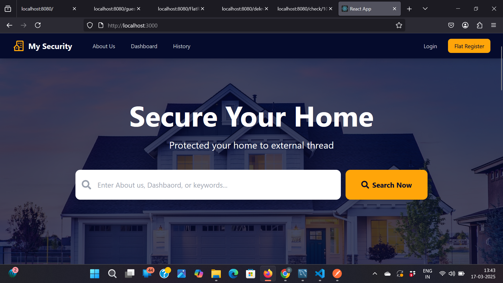

 # MySecurity
A full-stack Visitor Management System designed for residential societies and gated communities.
Inspired by apps like MyGate, this system enables secure and seamless entry management for visitors, delivery agents, staff, and residents

## 🚀 Features
- 🔔 Visitor Approval Workflow – Residents get real-time notifications to approve or reject visitor entry.
-👮 Security Dashboard – Gatekeepers can manage visitor entries through an easy-to-use interface.
-📦 Delivery Entry Logs – Separate flow for delivery agents like Swiggy, Zomato, Amazon, etc.

## 📸 Screenshot


## 🛠 Tech Stack
- React
- Spring Boot
- MySQL

## 📦 Installation
```bash
git clone https://github.com/your-username/your-repo-name.git
cd your-repo-name
npm install
npm start

